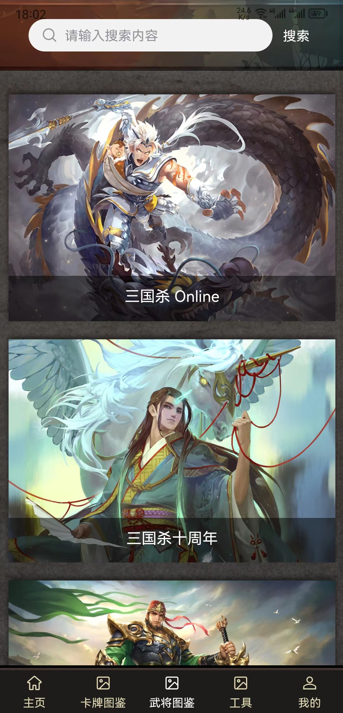
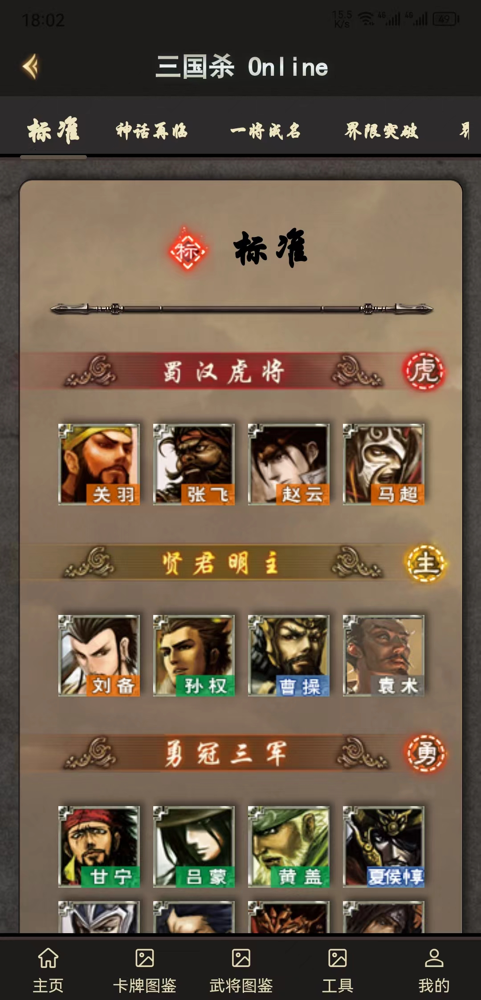
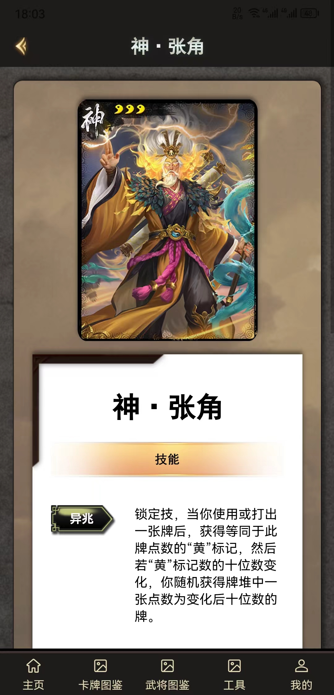
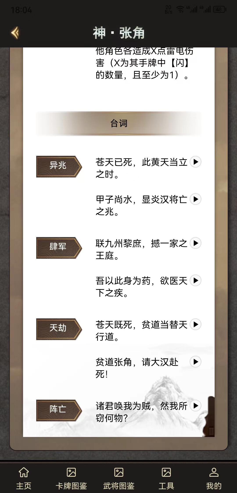

# Legends-of-the-Three-Kingdoms-Offline-Assistant
<!-- PROJECT SHIELDS -->

[![Contributors][contributors-shield]][contributors-url]
[![Forks][forks-shield]][forks-url]
[![Stargazers][stars-shield]][stars-url]
[![Issues][issues-shield]][issues-url]
[![Downloads][Download-shield]][download-url]

<!-- PROJECT LOGO -->
<br />

<p align="center">
  <h2 align="center"><strike>三国杀面杀助手</strike> 杀批宝典</h2>
</p>
<p align="center">
  
  <p align="center">
    <a href="https://github.com/Alex-McAvoy/Legends-of-the-Three-Kingdoms-Offline-Assistant"><strong>探索本项目的文档 »</strong></a>
    <br />
    <br />
    <a href="https://github.com/Alex-McAvoy/Legends-of-the-Three-Kingdoms-Offline-Assistant/issues">报告Bug</a>
    ·
    <a href="https://github.com/Alex-McAvoy/Legends-of-the-Three-Kingdoms-Offline-Assistant/issues">提出新特性</a>
    ·
    <a href="https://github.com/Alex-McAvoy/Legends-of-the-Three-Kingdoms-Offline-Assistant/releases">发行说明</a>
  </p>
</p>


## 目录

1. [说明](#说明)
2. [效果展示](#效果展示)
4. [开发指南](#开发指南)
   1. [项目运行](#项目运行)
   2. [文件目录说明](#文件目录说明)
   3. [工具](#工具)
   4. [部署](#部署)
   5. [使用框架](#使用框架)
5. [待处理](#待处理)
   1. [新特性](#新特性)
   2. [Bug](#Bug)
6. [参与项目](#参与项目)
   1. [如何参与](#如何参与)
   2. [贡献者](#贡献者)
7. [鸣谢](#鸣谢)

## 说明

本项目旨在为面杀提供便利，长期开发，长期维护

项目资源均来自于**三国杀官方**

由于作者俗务繁忙，因此预计该项目将长期处于 alpha 版，如有需要，请移步 [Releases](https://github.com/Alex-McAvoy/Legends-of-the-Three-Kingdoms-Offline-Assistant/releases) 下载

另考虑服务器成本，本项目目前为**静态项目**，安装包较大

## 效果展示

<p align="center">
  
  
  
  
  
</p>


## 开源协议

本项目开源协议为 [GPLv3](https://choosealicense.com/licenses/gpl-3.0/)，这意味着可以随意的使用、复制、修改和分发，但分发时一定要提供源码，且分发后的程序同样遵循GPL协议，程序的所有贡献者，自动提供免费专利许可。

## 开发指南

### 项目运行

1. 克隆项目

```sh
git clone https://github.com/Alex-McAvoy/Legends-of-the-Three-Kingdoms-Offline-Assistant.git
```

2. 进入项目文件夹并安装依赖

```sh
cd ./Legends-of-the-Three-Kingdoms-Offline-Assistant
npm i
```

### 文件目录说明

```
filetree 
├── /components/
├── /images/
├── /pages/
│  ├── /archive/
│  │  ├── detail.vue
│  │  ├── index.vue
│  │  └── list.vue
│  ├── /index/
│  │  └── index.vue
│  └── /mine/
│     └── index.vue
├── /static/
├── /uni_modules/
├── /utils/
│     └── online-video-spider.py
├── .gitignore
├── App.vue
├── README.md
├── index.html
├── main.js
├── manifest.json
├── package.json
├── pages.json
├── uni.promisify.adaptor.js
└── uni.scss

```

### 工具

`online-video-spider.py` 三国杀 Online 语音爬取脚本

调用说明：

```bash
python online-video-spider.py 游戏武将编号 实际编号 技能数 [--save_path 保存路径(可选)]
```

实例：

```bash
python online-video-spider.py 7003simayi wenWu-li-01 4 --save_path C:/Users/Alex/Desktop/mp3
```

### 部署

暂无

### 使用框架

- [uniapp](https://uniapp.dcloud.net.cn/)
- [uView 2.0.36](https://uviewui.com/components/intro.html)

## 待处理

### 进行中

- [ ] Online 武将列传
	- [ ] 璀璨星河
	- [ ] 谋扩展包
	- [ ] 门阀士族
	- [ ] SP
- [ ] 更改头像样式（爬取头像+生成文字）
- [ ] Online 国战图鉴
- [ ] 新武将
	- [ ] 神典韦
	- [ ] 蒋琬

### Bug

- [ ] Online 界程普无语音
- [ ] Online 界法正、界程普、界蔡夫人头像无标注


### 计划中

- [ ] 改为动态获取数据（租服务器，暂时没钱，欢迎赞助）
- [ ] 十周年武将图鉴
- [ ] 移动版武将图鉴
- [ ] 卡牌图鉴
- [ ] 工具
- [ ] 首页
- [ ] 我的

## 参与项目

### 贡献者

暂无

### 如何参与

项目组全体成员十分欢迎您为本项目贡献页面

大致流程如下：

1. 将主仓库 Fork 到自己的仓库中
2. 将 Fork 后的分支仓库 Clone 到本地
3. 在本地进行修改后 Commit 更改
4. 将这些更改 Push 到克隆的分支仓库
5. 提交 Pull Request 至主仓库

对于 Commit 摘要，按照如下格式书写：

```bash
[修改类型] 修改内容
```

修改类型分为以下几类：

- `Add`：添加新模块
- `Fix`：修正现有模块的错误
- `Update`：更新现有模块
- `Refactor`：对一个页面/模块进行重构（较大规模的更改）
- `Revert`：回退之前的更改

## 鸣谢

- [三国杀](https://www.sanguosha.com/)
- [三国杀WIKI](https://wiki.biligame.com/sgs/)
- [uniapp](https://uniapp.dcloud.net.cn/)
- [uView](https://uviewui.com/components/intro.html)


<!-- links -->
[contributors-shield]: https://img.shields.io/github/contributors/Alex-McAvoy/Legends-of-the-Three-Kingdoms-Offline-Assistant.svg?style=flat-square
[contributors-url]: https://github.com/Alex-McAvoy/Legends-of-the-Three-Kingdoms-Offline-Assistant/graphs/contributors
[forks-shield]: https://img.shields.io/github/forks/Alex-McAvoy/Legends-of-the-Three-Kingdoms-Offline-Assistant.svg?style=flat-square
[forks-url]: https://github.com/Alex-McAvoy/Legends-of-the-Three-Kingdoms-Offline-Assistant/network/members
[stars-shield]: https://img.shields.io/github/stars/Alex-McAvoy/Legends-of-the-Three-Kingdoms-Offline-Assistant.svg?style=flat-square
[stars-url]: https://github.com/Alex-McAvoy/Legends-of-the-Three-Kingdoms-Offline-Assistant/stargazers
[issues-shield]: https://img.shields.io/github/issues/Alex-McAvoy/Legends-of-the-Three-Kingdoms-Offline-Assistant.svg?style=flat-square
[issues-url]: https://img.shields.io/github/issues/Alex-McAvoy/Legends-of-the-Three-Kingdoms-Offline-Assistant.svg
[download-shield]: https://img.shields.io/github/downloads/Alex-McAvoy/Legends-of-the-Three-Kingdoms-Offline-Assistant/total.svg
[download-url]: https://tooomm.github.io/github-release-stats/?username=Alex-McAvoy&repository=Legends-of-the-Three-Kingdoms-Offline-Assistant